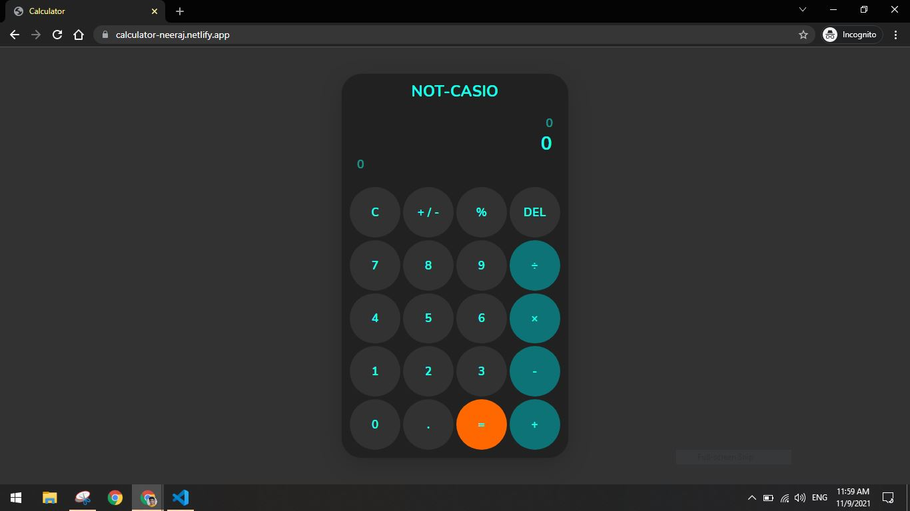
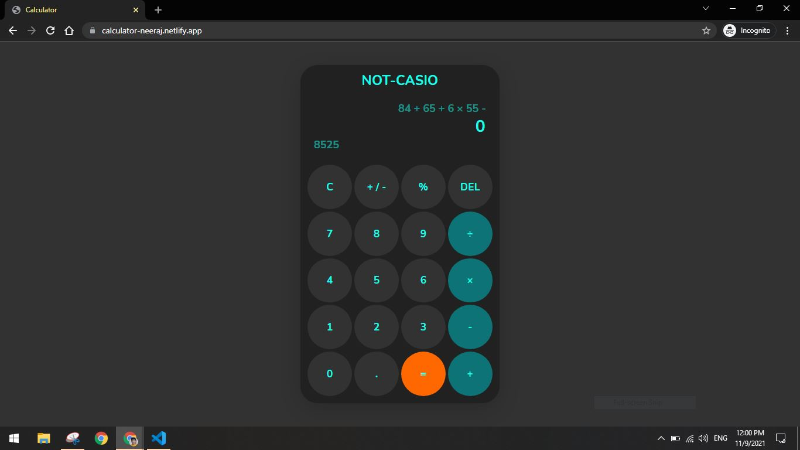

# Calculator

A calculator with three displays(1. Main display to show current value and result 2. Lower display to hold temporary result 3. Upper display to show history) which can perform arithmetic operations such as addition, subtraction, multiplication, division and modular division.
## Live Project

[click here](https://calculator-neeraj.netlify.app/)

## Tech Stack

**Client:** HTML, CSS, Javascript

**Deployed** from Github using Netlify

## Screenshots

## Upcoming Features

- Light/dark mode toggle

## Feedback

If you have any feedback, please reach out at vodalaneeraj@gmail.com

